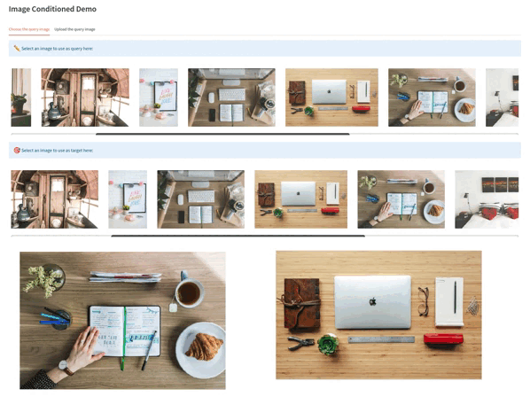

# OWL-ViT Demo - Complete

## Description

This is the complete version of the OWL-ViT demo.

It allows for text and image conditioned detection.

At the moment, this demo is WIP.  \
Report errors and bugs or suggest new features [here](https://docs.google.com/document/d/1jlvOguNI_cfDfYHG6LgDBC-OZqqzaxekXPJC3EmknhQ/edit)

## Example




## Development instructions

### Demo versions

Last update tested using:

* Python 3.10.5
* Node v16.16.0
* npm v8.11.0

### Option 1: Manual demo build

1.  Setup virtual environment.

    ```sh
    virtualenv venv && source venv/bin/activate
    ```

2.  Install requirements.

    ```sh
    pip install -r requirements.txt
    ```

3.  Run the app on localhost.

    ```sh
    streamlit run app.py
    ```


### Option 2: Docker build

1.  Build image from the source directory.

    ```sh
    docker build -t owl-vit-demo .
    ```

2.  Run it on localhost

    ```sh
    docker run --network="host" owl-vit-demo
    ```
