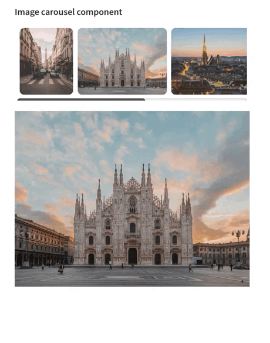

# Streamlit - Image Carousel Component

## Description

The objective of this component is to render an image carousel given a list of image URLs.

The component will be initialized with a list of URLs given from Streamlit. An image carousel will be rendered with each of the images in the list, in the same order. When clicking any of the images from the carousel, its URL will be returned as the component value.

Internally, the implementation is done using the Svelte framework. This way, we give an example of a framework different than React for implementing Streamlit components. In addition, this implementation had to adapt the handshaking between the component and Streamlit, and thus, it also makes for a better understanding of how this connection works.

## Example




## Development instructions

### Package versions

Last update tested using:

* Python 3.10.5
* Node v16.16.0
* npm v8.11.0

### Package build

1.  Setup virtual environment.

    ```sh
    virtualenv venv && source venv/bin/activate
    ```

2.  Install pip package.

    ```sh
    pip install -e .
    ```

### Execution instructions

From separate terminals, in the package folder:

1. Start development server

  ```sh
  cd src/streamlit_image_carousel/frontend
  npm install && npm run dev
  ```

2. Start the Streamlit app

  ```sh
  cd example
  streamlit run example_app.py
  ```

3. Access your app through `localhost:8501`.