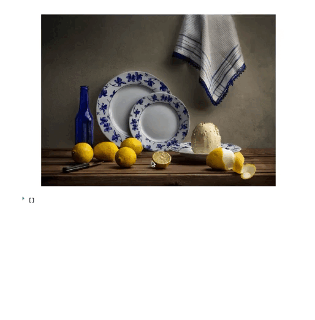

# Streamlit - Relayout Event Handler for Plotly

## Description

The objective of this component is to provide a handler for relayout events in
Plotly plots.

Relayout events are those that consist of a change in the plot's layout,
i.e. the addition of a shape or annotation.

The component will get a Plotly figure from Streamlit, render it and listen to
relayout events. On happening, the component will capture the coordinates of the
annotation or shape drawn in the plot and will return them in a dictionary.

## Example




## Development instructions

### Package versions

Last update tested using:

* Python 3.10.5
* Node v16.16.0
* npm v8.11.0

### Package build

1.  Setup virtual environment.

    ```shell
    virtualenv venv && source venv/bin/activate
    ```

2.  Install pip package.

    ```shell
    pip install -e .
    ```

3.  Enter example directory and install requirements for the example app.

    ```shell
    cd example
    pip install -r requirements.txt
    ```

### Execution instructions
 From separate terminals, in the package folder:

1. Start development server

  ```shell
  cd src/streamlit_plotly_event_handler/frontend
  npm install && npm start
  ```

2. Start the Streamlit app

  ```shell
  cd example
  streamlit run example_app.py
  ```

3. Access your app through `http://localhost:8501`.
